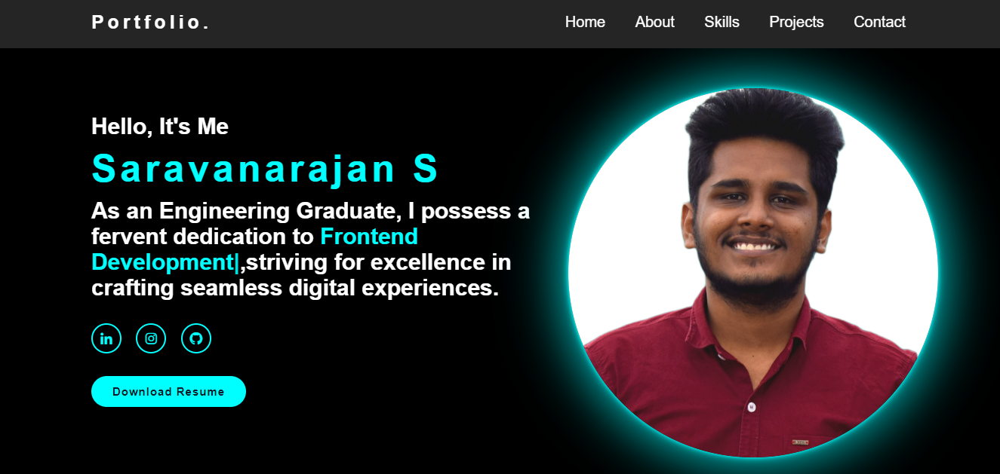

# Portfolio Website



## Overview
Welcome to my portfolio website repository! This website showcases my skills, projects, and experiences as a web developer. Feel free to explore the various sections to learn more about me and my work.

## Features
- **About Me:** Get to know me better through a brief introduction and overview of my skills and experiences.
- **Projects:** View a selection of my notable projects, each with a description, technologies used, and a link to the live demo or GitHub repository.
- **Skills:** Browse through the technologies and tools I'm proficient in, including programming languages, frameworks, and design tools.
- **Contact:** Reach out to me via email or connect with me on LinkedIn or other social media platforms.

## Technologies Used
- **HTML/CSS:** Used for structuring and styling the website.
- **JavaScript:** Implemented interactive elements and functionality.
- **React.js:** Built the website using React components for a dynamic user experience.
- **Bootstrap:** Utilized Bootstrap framework for responsive design and layout.
- **GitHub:** Hosted the code repository and utilized GitHub Pages for deployment.

## Installation
1. Clone this repository to your local machine:
   ```bash
   git clone https://github.com/Saravanarajan29/My-Portfolio.git
2. Navigate to the project directory:
      ```bash
    cd portfolio-website
3. Open the index.html file in your web browser or deploy the website to a hosting service of your choice.

## Usage
Feel free to customize this portfolio website template to showcase your own projects and skills. Modify the content in the `src` directory, update the styles in the `styles` directory, and add or remove sections as needed to fit your preferences.

## Author

Developed by **Saravanarajan**.
